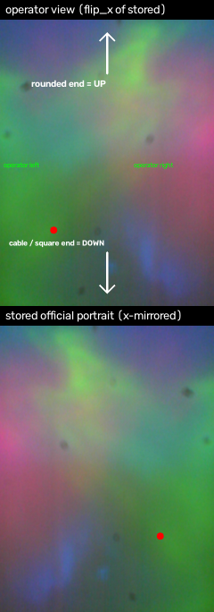

# DIGIT tactile sensor toolkit

> **In short:** this toolkit puts everything you need for the DIGIT tactile sensor behind one
> `make <command>` (or `python -m digit <command>`): reading frames, LED control, resolution and
> frame rate, live views, contact detection and localisation, relative depth and normals, texture
> flow and slip detection, recording and playback, a small trainable classifier, tests and docs.
> Five steps to start: `make setup` → plug in the sensor → `make check` → `make view` → `make record`.
> Every live quantity (area, force proxy, depth) is **relative and uncalibrated**, not millimetres or
> newtons. Each feature's parameters and limits are in [`FEATURES.md`](FEATURES.md); the open-source
> projects used and their licences are in [`CREDITS.md`](CREDITS.md).

A small, beginner-friendly toolkit for the **Facebook/Meta DIGIT** optical
tactile sensor (USB `2833:0209`), modelled on the lab's GelSight toolkit
(`deploy/thor/gelsight`): one Makefile of simple commands, a live viewer, a
headless monitor, a udev rule and a USB reset.

Everything is in this folder. You do not need to know the sensor to start:
run `make setup`, plug it in, run `make check`, then `make view`.

---

## What is a DIGIT?

The DIGIT is a small, camera-based tactile sensor. A soft gel pad is lit by
RGB LEDs; a camera behind the gel photographs it. When something presses on the
gel the image deforms, and the change tells you **where** the contact is, how
**large** it is and (roughly) how **hard** the press is. It is the little
brother of the GelSight Mini: same idea, cheaper, smaller field of view, no
metric depth calibration out of the box.

On this machine the sensor is:

| fact | value |
| --- | --- |
| USB id | `2833:0209` (`lsusb` → *Oculus VR, Inc. DIGIT*) |
| serial | `D20576` |
| capture node | `/dev/video0` (the other node, `/dev/video1`, is metadata only) |
| stable path | `/dev/v4l/by-id/usb-Facebook_DIGIT_D20576-video-index0` |
| modes | `640x480 @ 30/15 fps`, `320x240 @ 60/30 fps` (YUYV) |
| LED | 12-bit RGB, 0..15 per channel, exposed through UVC "Zoom" |
| image | portrait after the official orientation fix (VGA → 480x640 shown) |

The sensor produces a colour image with a bright, slightly rainbow-lit gel and
a dark housing border. The toolkit auto-detects the usable gel area
(`processing.active_region`) so the border is never counted as contact.

### Which end is up

Hold the sensor with the **rounded end up** (an arrow on the back
points that way) and the **square cable end down**. The raw buffer is
landscape; the camera's *official* portrait view (`transpose` + vertical flip)
is **left-right mirrored** relative to the operator, while up is already up.
`DigitCamera(orientation="operator")` (the CLI default) therefore flips x, so
the live view and every processing view show the sensor as it is held; pass
`--orientation official` or `--raw` for the stored camera views. Sessions
record their `frame_orientation` in `meta.json`, and
`digit.orientation.to_operator` converts an older official-frame session.
`docs/images/real_20260925_orientation.png` is the picture of which end is up
(top = rounded end, bottom = cable, and the stored frame mirrored below).



---

## Five-minute quick start

```bash
cd rebecca/digit

make setup          # one time: creates the conda env 'digit' and installs deps
make check          # is it found? are frames arriving? what fps?
make reference      # average 15 untouched frames -> reference.png (touch nothing!)
make view           # live dashboard: camera | difference | contact | depth | normals | flow
```

Leave the gel untouched while `make reference` runs (~0.5 s). The reference is
the "no contact" image that every later difference is measured against.

If `make check` says *no sensor found*, see [Troubleshooting](#troubleshooting).

Interactive keys in `make view`: `q`/`Esc` quit, `s` save a screenshot to
`snapshots/`, `r` re-capture the reference, `p` pause, `[`/`]` step the frame
rate, `v` toggle 640x480/320x240. Every mode change stopped the reader and
closed/reopened the device — never a live property change.

---

## Commands

Run `make help` for the same list. Every command is a thin wrapper over
`python -m digit <command>`, and accepts `SERIAL=`, `NODE=`, `RES=`, `FPS=`,
`LED=`, `THRESHOLD=`, `FRAMES=` overrides, e.g. `make view LED=8 MODE=depth`.

### Setup and inspection

| command | what it does |
| --- | --- |
| `make help` | list every command (default target) |
| `make setup` | create the `digit` conda env and install `requirements.txt` |
| `make check` | sensor found? capture node? supported modes? frames arriving? measured fps? saves `.logs/check_frame.png` |
| `make info` | serial, node, revision and the supported V4L2 modes |
| `make list` | list DIGIT video nodes and their stable `by-id` paths |
| `make modes` | one line per supported resolution/fps |
| `make benchmark` | measure real fps at every supported mode, writes `.logs/benchmark.json` |
| `make udev-check` | is `99-digit.rules` installed? |
| `make reset` | soft USB reset (like a replug); needs the udev rule or sudo |
| `make install-udev` | install `99-digit.rules` (needs sudo, once) |

### Capture and control

| command | example | notes |
| --- | --- | --- |
| `make snapshot` | `make snapshot` | one frame → `snapshots/snapshot_<time>.png` |
| `make reference` | `make reference` | 15-frame average → `reference.png` and `reference.npy` |
| `make led` | `make led LEVEL=8` | set all LED channels, 0..15 |
| `make led-rgb` | `make led-rgb R=15 G=0 B=0` | independent channels (the DIGIT has RGB LEDs) |
| `make fps` | `make fps FPS=15` | open at that fps and measure it (modes: 30/15 at VGA) |
| `make resolution` | `make resolution RES=320x240` | open at that resolution and measure |

### Live views

| command | what you see |
| --- | --- |
| `make view` | 3x2 dashboard: camera, difference, contact mask, relative depth, relative normals, optical flow |
| `make view MODE=diff` | amplified signed difference (most sensitive contact view) |
| `make view MODE=contact` | frame + contact mask + centroid + area/force |
| `make view MODE=depth` | colour-mapped relative depth |
| `make view MODE=normal` | relative surface normals |
| `make save MODE=<mode> OUT=file.png FRAMES=60` | headless: render a view and write it (screenshots, no display needed) |
| `make view-diff` / `view-contact` / `view-depth` / `view-normal` | shortcuts that write `.logs/view_*.png` |
| `make monitor SECONDS=10` | headless text state: `touch`, `area`, `force`, `cell`, `slip`, `fps` |
| `make monitor-json SECONDS=10` | the same as one JSON object per frame (for a robot/front-end) |
| `make demo` | sensor-free: renders every view from a synthetic animated contact to `docs/images/` |

### Recording and replay

| command | what it does |
| --- | --- |
| `make record SECONDS=10` | record to `sessions/<timestamp>/` (PNG frames + `frames.csv` + `meta.json` + `video.avi`) |
| `make record NAME=grip SECONDS=5` | record to `sessions/grip/` |
| `make sessions` | list recorded sessions |
| `make play SESSION=sessions/grip` | print a numeric summary (frames, duration, touch ratio if a reference exists) |
| `make play SESSION=sessions/grip PROCESS=contact OUT=replay.avi` | replay as a processed video |
| `make play SESSION=sessions/grip PROCESS=dashboard OUT=sheet.png STEP=12` | contact-sheet montage |
| `make play SESSION=sessions/grip PROCESS=depth --show` (CLI only) | replay in a window |

### Recognition

| command | what it does |
| --- | --- |
| `make eval` | **measured** touch detection, localisation and classification on synthetic contacts; writes `.logs/eval.json` |
| `make eval REFERENCE=reference.npy` | the same, but synthetic contacts added to the **real** gel reference |
| `make synth` | build a synthetic feature dataset (`datasets/synthetic.npz`) |
| `make train DATASET=datasets/synthetic.npz MODEL=models/c.pkl` | train + evaluate kNN/SVM/logreg |
| `make collect LABELS="screw bolt"` | interactively collect labelled **real** samples (you press the object, Enter, then N frames are saved) |
| `make press-test` | guided **real-press protocol**: untouched → one finger at 6 places → slide → small object; writes a labelled session (`labels.csv`, `protocol.json`); the stored reference is the median of its own untouched frames |
| `make eval-session SESSION=sessions/press_...` | **real** TPR / FPR / localisation error / slip from that session; rebuilds the reference from the session's untouched phase (`REFERENCE=` overrides) |
| `python examples/eval_session_holdout_d4.py SESSION` | honest half/half held-out run: orientation check, per-cell localisation (brightness and lighting-invariant deformation), slip events per label |
| `make predict MODEL=models/c.pkl` | live prediction with a trained model |

### Development

| command | what it does |
| --- | --- |
| `make test` | 42 sensor-free pytest tests (adds capture safety + roll fix + session reference) |
| `make selftest` | sensor-free end-to-end smoke test of processing/recognition/recording |

---

## Where files go

```
reference.png / reference.npy     no-contact reference (regenerated by `make reference`)
snapshots/                        single frames from `make snapshot` / `s` key
sessions/<name>/                  one folder per recording:
    frames/000000.png ...         lossless frames
    frames.csv                    index, timestamp_ns, filename  (per-frame timestamps)
    meta.json                     serial, node, mode, LED, start/end, count
    video.avi                     optional MJPEG preview
    reference.png                 session reference (untouched median for press-test)
datasets/                         feature datasets (.npz)
models/                           trained classifiers (.pkl)
.logs/                            check/benchmark/eval JSON and headless renders
docs/images/                      documentation and report images
```

Generated data (`sessions/`, `snapshots/`, `datasets/`, `models/`, `.logs/`,
`*.npy`) is git-ignored; the code and docs are committed.

---

## The one API you need in Python

```python
from digit import DigitCamera, find_digit
from digit import processing as P, recognition as R, recording as rec

print(find_digit().serial)                 # 'D20576'

with DigitCamera() as cam:                 # opens /dev/video0 at 640x480@30
    cam.set_led(12)
    reference = cam.read()                 # keep the gel untouched!
    frame = cam.read()
    signed = frame.astype("float32") - reference.astype("float32")
    mask = P.contact_mask(signed, threshold=10.0, min_area=40)
    stats = P.contact_stats(mask, signed)
    print(stats.centroid, stats.area_px, stats.force)

    result = R.TouchDetector(reference).detect(frame)
    print(result.as_dict())                # {'touch': ..., 'cell': ...}
```

`DigitCamera` picks the capture node automatically, applies the official
portrait transform and then the `orientation=` preset (default `operator`, the
sensor as held; `--raw` for the native buffer), and supports per-channel LED
control. See [`FEATURES.md`](FEATURES.md) for every parameter.

---

## Troubleshooting

**`make check` says "no DIGIT sensor found".**
Check `lsusb | grep 2833` (expected `2833:0209 Oculus VR, Inc. DIGIT`). If it is
missing, it is a cable/port problem; try another port. If it is present, run
`make list`: a DIGIT always exposes two nodes and only one can stream.
`DigitCamera` prefers the capture node automatically.

**"could not open /dev/video0" / permission denied.**
Your user must be in the `video` group. Check with `id`; if not, a login-time
change is needed: `sudo usermod -aG video "$USER"` then log back in. (On this
machine `jamie` is already in `video`.)

**No frames, `select() timeout`, or a wedged sensor.**
A UVC/DIGIT can wedge after an unlucky reconfiguration or a suspend. On
2026-09-24 a live frame-rate change (`cap.set(CAP_PROP_FPS)`) on an already
streaming handle wedged this unit until it was physically replugged. **Do not
change fps/resolution mid-stream**; the toolkit now closes and reopens the
device for every mode change (`DigitCamera.set_mode`, and the `[`/`]`/`v` keys
in `make view`), so the mode is always applied before the first read. Other
programs may still poke a live stream. To recover, replug the sensor, or
install the udev rule once (`make install-udev`) so the soft reset works:
`make reset` (without the rule it needs `sudo make reset`).

**The image shifts sideways and wraps with a seam (a rolled frame).**
A YUYV buffer misalignment can wrap the image around a vertical seam; it is a
capture artifact, not contact. `DigitCamera.read()` detects the wrap (one
sharp, isolated column discontinuity) and rolls it back before returning the
frame; if a roll does not clear after a few frames it reopens the device.
`detect_roll`/`fix_roll` in `digit.capture` expose the test. A *physical*
sideways move of the sensor does not wrap, so it is left alone — re-capture the
reference after moving the sensor.

**The reference goes stale / a broad low-contrast change appears.**
Cable tension or a small shift of the sensor on the table deforms the gel
slightly, and the difference against an old reference lights up across the
whole gel. Secure the cable, avoid pulling it, and re-take the reference
(`make reference` or the `r` key) after any move. A localised, high-contrast
blob is contact; a broad, low-contrast change is not. `make eval-session` no
longer trusts a stale session `reference.png`: it rebuilds the reference as the
median of the session's own untouched frames (the 2026-09-25 session's stored
`reference.png` differed from its untouched phase in 99.97 % of pixels and made
all 251 untouched frames false positives).

**Wrong node / "opened but no frames".**
Use `make list` and the stable path
`/dev/v4l/by-id/usb-Facebook_DIGIT_D20576-video-index0`, or force it:
`make check NODE=/dev/video0`. Never point at `video1`; it is metadata only.

**Washed-out or very dark image.**
Set the LED: `make led LEVEL=15` (max) or `make led LEVEL=8` (softer). The
image is auto-exposed by the camera, so raising the LED does not always raise
the mean brightness; use `make led-rgb R=15 G=0 B=0` to see the colour change.
On this unit the `CAP_PROP_ZOOM` **readback** is clamped to 255 and is not a
reliable indicator; the frame means printed by `make led` are.

**The image is mostly dark at one side.**
The camera sees the sensor housing as well as the gel. The toolkit's
`active_region` mask (default: brightness above the 15th percentile, largest
component, convex hull) removes it, and `area_frac` is measured relative to the
gel area, not the whole frame.

**Live window does not open.**
If there is no display (`echo $DISPLAY` empty, e.g. over SSH) use
`make save MODE=dashboard OUT=shot.png` or `make monitor`; both are headless.
`DIGIT_NO_WINDOW=1` forces headless mode.

**LED control seems to have no effect.**
The DIGIT maps LED intensity onto the UVC "Zoom, Absolute" control. Some other
programs/cameras also use Zoom; make sure only one program has the camera open.

---

## Credits and licence

See [`CREDITS.md`](CREDITS.md) for the full table. In short: the capture/LED
conventions follow `facebookresearch/digit-interface` (CC-BY-NC-4.0, referenced
but **not** imported); the feature set is inspired by `facebookresearch/PyTouch`
(MIT), `facebookresearch/digit-design` (CC-BY-NC-4.0), `gelsightinc/gsrobotics`
(GPL-3.0) and the lab's GelSight toolkit; the Poisson/DCT depth integration is
an independent implementation of the standard algorithm. No third-party source
is vendored. Note that the optional V4L2 enumeration dependency `linuxpy` is
GPL-3.0-or-later, so review licences before redistributing.
